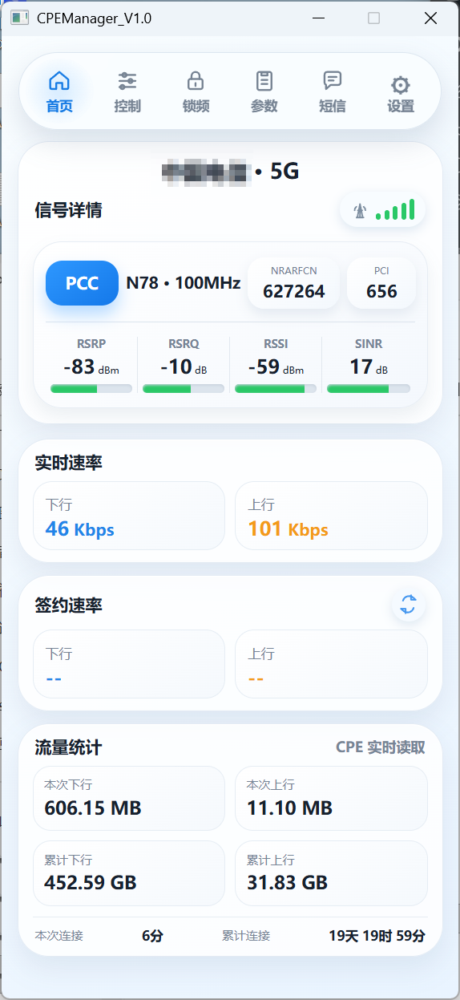
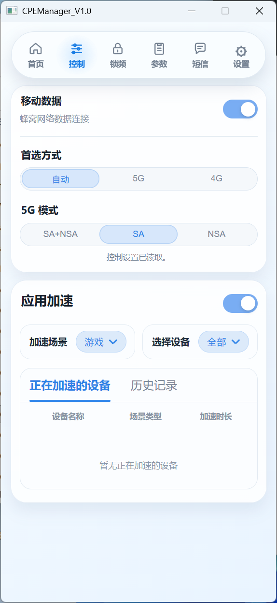
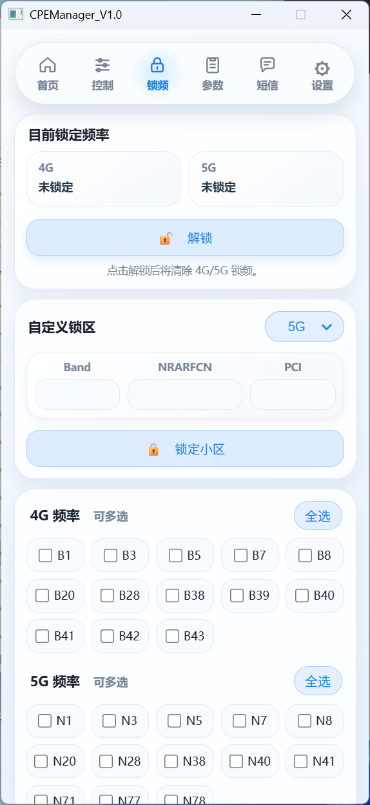
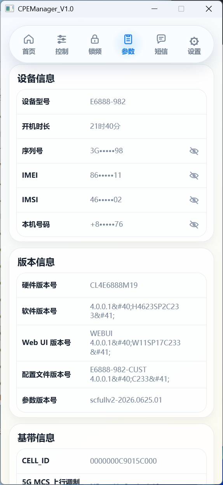
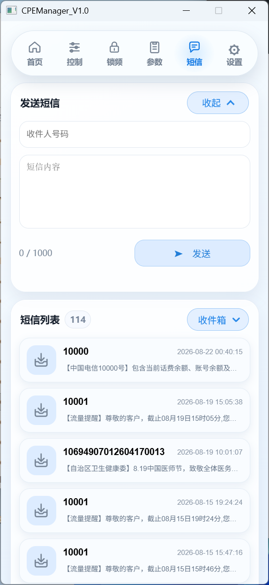
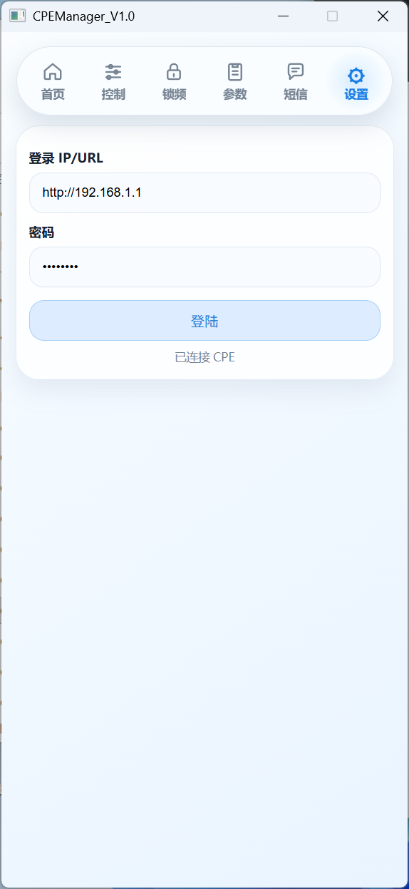

# CPEManager

[中文](#中文) · [English](#english)

---

## 中文

CPEManager 是一款面向兼容华为 CPE 路由器的 Windows 桌面管理工具。

它通过路由器的本地 Web API 提供更直观的管理界面，可查看 4G/5G 信号、网络状态、设备信息和短信，并支持网络模式切换、频段锁定和设备加速管理。

### 界面截图

<p align="center">
  
  
</p>
<p align="center">
  
  
</p>
<p align="center">
  
  
</p>

### 功能

- 实时查看 RSRP、RSRQ、RSSI、SINR 等 4G/5G 信号参数
- 查看主载波、辅载波、频段、带宽、ARFCN 和 PCI
- 查看上下行速率、流量统计和联网时长
- 查看设备型号、IMEI、IMSI、软硬件版本等信息
- 切换网络偏好、5G SA/NSA 模式和移动数据
- 锁定或解除 4G/5G 频段与小区
- 查看、发送和管理短信
- 查看已连接设备和支持的设备加速状态

### 使用

1. 将电脑连接到 CPE 所在局域网。
2. 启动 CPEManager。
3. 输入 CPE 管理地址和密码并登录。
4. 在首页、控制、锁频、参数和短信页面使用对应功能。

### 构建

需要 Windows 10 或更高版本，以及安装了 C++ 桌面开发工作负载的 Visual Studio 2022。

在 Visual Studio 开发者命令提示符中运行：

```bat
build-release.bat
```

首次构建时，脚本会自动下载 WebView2 SDK。

### 隐私与安全

登录信息仅保存在本机，并使用 Windows 用户级加密保护。请勿提交登录文件、WebView 浏览器数据、日志或编译产物。

仅在你拥有或被授权管理的 CPE 上使用本软件。

### 兼容性

不同 CPE 型号和固件的本地 API 可能不同。欢迎通过 Issue 提交兼容性反馈，并注明设备型号和固件版本。

---

## English

CPEManager is a Windows desktop management tool for compatible Huawei CPE routers.

It provides a more intuitive interface through the router's local Web API, allowing users to monitor 4G/5G signal data, network status, device information, and SMS messages, as well as manage network modes, band locking, and device acceleration.

### Screenshots

<p align="center">
  
  
</p>
<p align="center">
  
  
</p>
<p align="center">
  
  
</p>

### Features

- Monitor 4G/5G signal metrics, including RSRP, RSRQ, RSSI, and SINR
- View primary and secondary carrier bands, bandwidth, ARFCN, and PCI
- View upload/download rates, traffic usage, and connection duration
- View device model, IMEI, IMSI, hardware version, and software version
- Switch network preferences, 5G SA/NSA modes, and mobile data
- Lock or unlock 4G/5G bands and cells
- View, send, and manage SMS messages
- View connected devices and supported device acceleration status

### Usage

1. Connect your computer to the local network of the CPE router.
2. Start CPEManager.
3. Enter the CPE management address and password.
4. Use the Home, Control, Band Lock, Parameters, and Messages pages as needed.

### Build

Windows 10 or later and Visual Studio 2022 with the **Desktop development with C++** workload are required.

Run the following command from a Visual Studio Developer Command Prompt:

```bat
build-release.bat
```

The WebView2 SDK will be downloaded automatically during the first build.

### Privacy and Security

Login information is stored only on the local computer and protected with Windows user-level encryption. Do not commit login files, WebView browser data, logs, or build artifacts.

Use this software only with CPE routers that you own or are authorized to manage.

### Compatibility

Local APIs may vary by CPE model and firmware version. Please open an Issue with the device model and firmware version if you encounter a compatibility problem.

## License

This project is licensed under the [MIT License](LICENSE).
